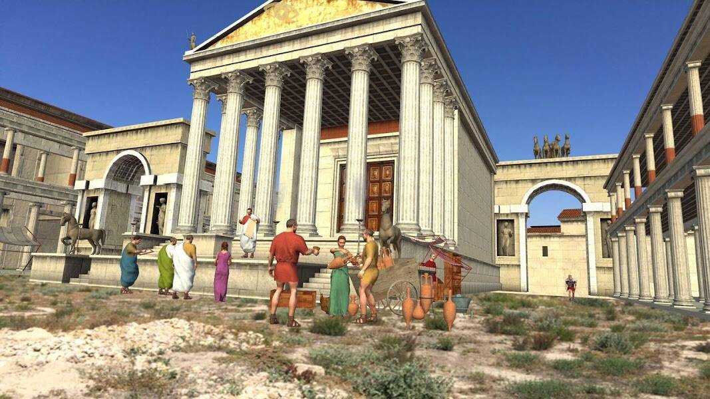

# Arcona Digital Land

Arcona 是全球增强现实生态系统，基于其自身独特的技术平台，可在全球各地自动生成全球增强现实层。 事实上，它是行星表面的虚拟模型，每一米都与物理世界中的特定位置完美关联。 整个全球数字土地层被分成不同的部分——100平方米的六边形地块。 每个地块的坐标在 Arcona 的去中心化数据库中指定和设置，并在智能合约中按 ETH 721 标准列为不可替代的代币 Arcona Digital Land (ARDL)。这是一个为交互式内容远程放置做好充分准备的 Digital Land 地块 在现实世界中。 就是这样，在纽约，您可以轻松地在墨西哥城的中央广场获得一块土地，并在您家中的舒适沙发上进行互动表演。

