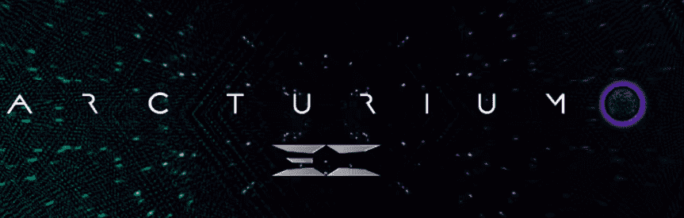

# Arcturium

大角星是从一些行星的中心开采的元素。 它用于支持银河货币。 Arcturium NFT 系列中有四种稀有物品：Raw、Arc-14、Blue 和 Radioactive。 Arcturium 持有者将能够在 Eternity Complex 项目中铸造其他 NFT。

▶ 什么是 Arcturium？

Artrium 是一个 NFT（不可替代令牌）集合。存储在区块链上的数字艺术品集合。

▶ 有多少 Arcturium 代币？

总共有 17 个 ArcturiumT。目前 9 位所有者的钱包中至少有一个 Artrium NTF。

▶ 最近卖了多少Arcturium？

过去 30 天内售出 0 个Arcturium NFT。

手绘数字艺术

