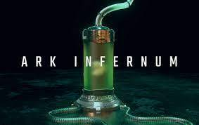

# Ark Infernum

## 简介

人类为了加速进化，发明了一种病毒，可以把人变成地狱生物。这似乎是上天对他们骄傲自满的惩罚。为了拯救人类物种，人们把许多载有遗传物质的太空舱送到遥远的太空角落，按照他们的逻辑，这应该会增加生存的机会。然而，拯救这个物种的希望已经破灭。太空中充满了为领土和资源而战的地狱生物。

### 游戏规则

01.

低温太空舱

获得含有胚胎的太空舱。你将能够在方舟币的帮助下将你的胚胎培养成一个怪物。最多供应3万个太空舱。

02.

代币赌注

用其他游戏币下赌注来赚取方舟币。这些代币可以用来培养你的怪物、购买能力和在竞技场中战斗。

03.

能力

将有10种类型的能力。你可以将这些能力装备到你的怪物身上，从而在竞技场中获得优势。这些能力都有一个升级系统。混合2个1级火焰技能，你将获得1个2级火焰技能。可以通过方舟币购买这些能力。

