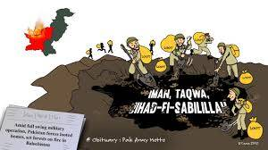

# Army Loot

战利品军队是随机生成并存储在链上的冒险家军队。 随意以任何你想要的方式使用军队。 军队由剑士弓箭手马大象龙巫师与战利品兼容（适用于冒险家）。 #0-8000 对战利品持有者来说是免费的。 #8001-11976 以 0.02 ETH 向公众开放。 24个保留给团队。

▶ 什么是Army Loot？

TheZombies Loot 是一个 NFT（不可替代令牌）集合。存储在区块链上的数字艺术品集合。

▶ 有多少Army Loot代币？

总共有 3 个 TheZombies Loot NFT。目前，44 位所有者的钱包中至少有一个 TheZombies Loot NTF。

▶ 最近售出了多少Army Loot？

过去 30 天内共售出 0 个 TheZombies Loot NFT。

