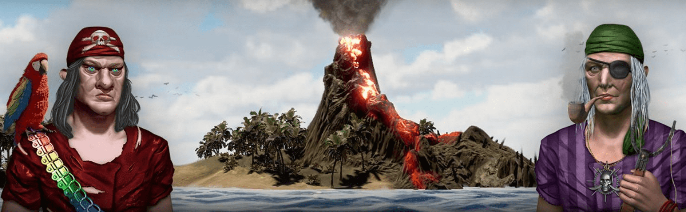
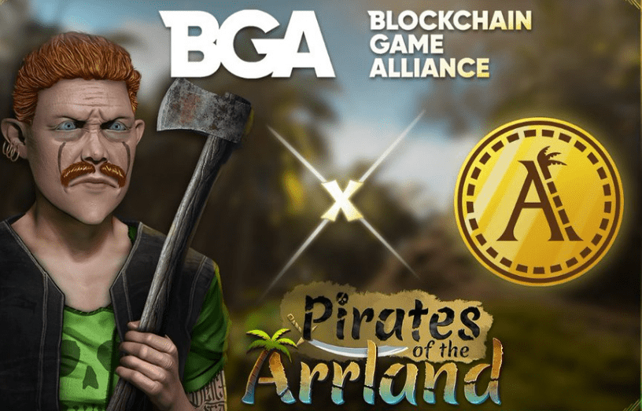
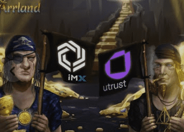

# ArrlandNFT

免费玩和赚取元宇宙游戏，具有独特的功能，结合了冒险叙事活动（To Edi）

骑手、我们岛屿的沙盒设计（House Flipper）和海盗环境中的经济元素（定居者）（小偷之海）。

未来将添加高级游戏模式，如合作和多人游戏，包括各种游戏设置、交易、海战、登机、与敌人战斗、比赛和完成其他任务一起。

**Anfata games**是一家欧盟注册的电子游戏公司，由一位经验丰富的开发人员创建，他负责创建2款已经在Steam上发布的游戏（1964年用户评论中有83%是正面的，售出30多万份），其其他游戏演示在Steam的愿望清单上进入了前70名。

多种有意义的方式来赚取和花费$RUM实用型代币（海盗复制，任务完成，游戏内交易物品，租赁和出售土地）

