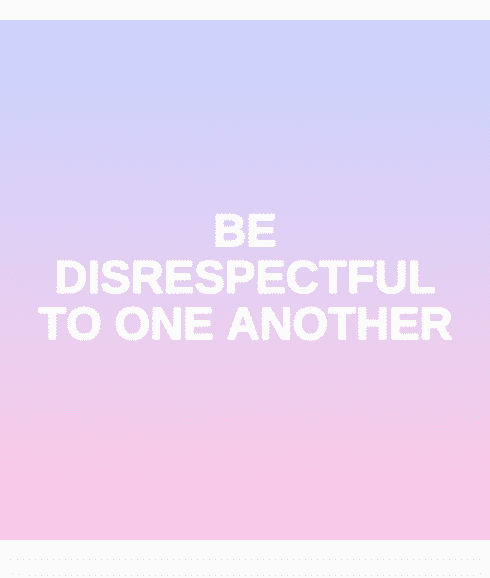
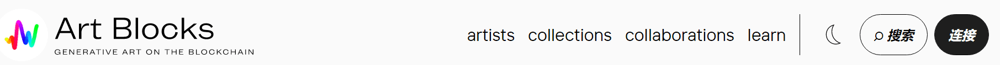
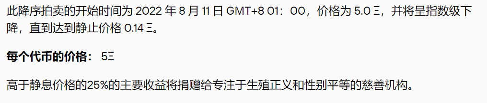

# Art Blocks

Art Blocks是首家真正可编程的按需生成内容的店面，这些内容不可变地存储在以太坊区块链上。

您选择您喜欢的样式，为工作付费，然后由算法创建随机生成的内容版本并发送到您的以太坊帐户。

结果可能是静态图像、3D模型或交互式体验。每个输出都是不同的，可以在平台上创建的内容类型有无穷无尽的可能性。

*《Fake IT TILL YOU MAKE IT》*借用了文本驱动的instagram图形的活泼语言和柔和的美学，以仔细检查社交媒体上对健康，自我护理和信心的促进。

这篇文章集中于这些帖子中使用的修辞。有说服力，乐观，无情的鼓舞人心，每个人都有一种权威感。通过重新混合来自这些类型的现有instagram帖子的单词和短语，该程序生成了模仿其欢快语气的组合，但范围从模糊熟悉到完全荒谬。

文本被包裹在“女孩力量积极共鸣老板宝贝”的糖饼干美学世界中，模仿旨在吸引你眼球的图形，因为你正在滚动你的提要。视觉变量包括输出的背景样式，调色板和布局，以及其他装饰元素，如星星✹，心♡形，花朵✿和火花✧:D

在线上，这些媒体对象在喜欢，评论和分享中生存。*我相信什么？*变成*我想看起来相信什么？*假装它，直到你成功！也许你的梦想生活就在这里：在一个数字的幻想世界中，算法扮演上帝，爱自己就像看着屏幕的光线。

