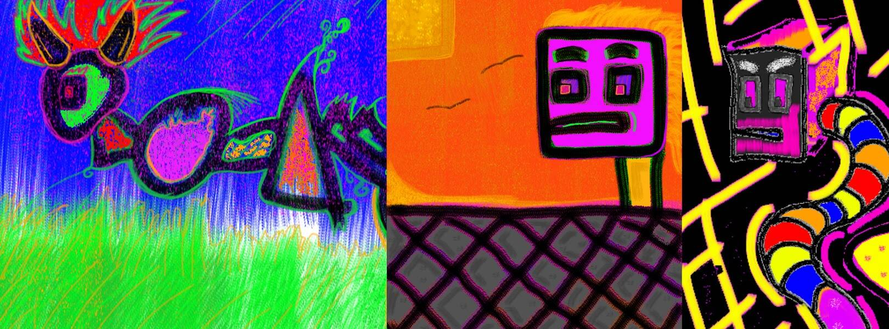

# Art, by Empathetic Alchemy

展示； 块头集合。 灵感来自我的感受和记忆...... Emotions 系列的延伸，这是与多位艺术家合作的：@RomanceAndAils（已售出）、WGMeets（已售出）@PopYuloo（已售出）和@wondermundo（已售出）！

我们目前生活在一个以男性能量竞争、基于成就的思维为动力的世界中。这个世界需要更多的女性能量来治愈它的伤口——富有同情心的、养育的、善解人意的能量。是时候让我们发挥自己的力量并让其他女性与我们一起成长了。WMN 项目为来自不同背景的女性提供了一个安全的空间，让他们可以协作并创造美丽和赋权的艺术，并将更多女性带入 NFT 空间。每个系列都将由所有女性团队制作和创作，旨在为艺术界下一阶段的女性创造就业机会和空间。

Space Age 是 WMN 项目的首个系列。它突出了对无边界创造力新时代的发现。

特别感谢使这个系列成为可能的强大女性创意团队：模特- Ella Orten，创意总监- Elen Dali，化妆- Skyla Swafford，视频- Rachel Banu。一定比例的利润将捐赠给 RAINN。

