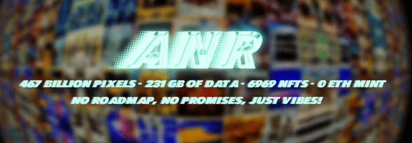

# Art Not Real

Art Not Real 是 6969 张高分辨率 AI 生成图像的集合。6969 张令人惊叹的详细 8K 图像或超过 4670 亿像素。该项目可在 CC0 许可下使用，这意味着您可以以任何您想要的方式使用图像 ！把它们变成一个真实的东西并打印在大画布上来装饰你的退化洞穴，或者如果你太懒了，就设置一个作为你的壁纸，每天享受人造美！ 直接从 Arweave 网络查看并下载完整的详细版本！加入 Discord 关注 Twitter

Art Not Real NFT 在过去 7 天内售出 431 次。Art Not Real 的总销售额为 2.76 万美元。一份 Art Not Real NFT 的平均价格为 6.4 美元。共有 1,931 位 Art Not Real 所有者，总共拥有 6,969 个代币。

Art Not Real 是**6969**张高分辨率 AI 生成图像的集合。

6969 张令人惊叹的详细 8K 图像或超过**4670 亿像素。**

该项目在**CC0 许可**下可用，这意味着您可以以任何您想要的方式使用图像！

