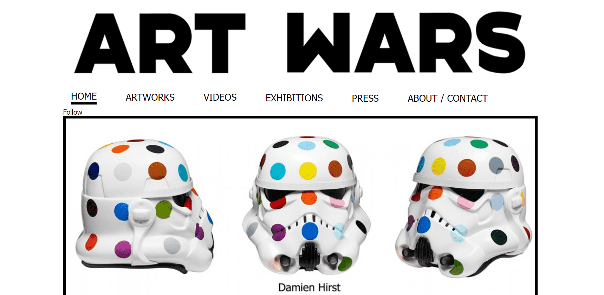
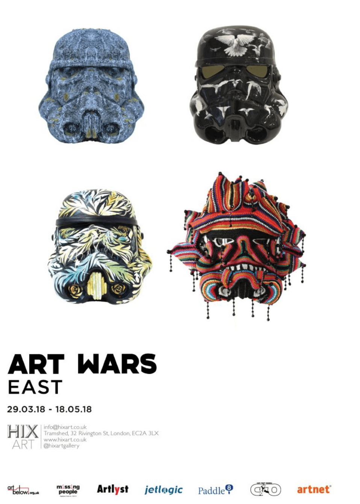
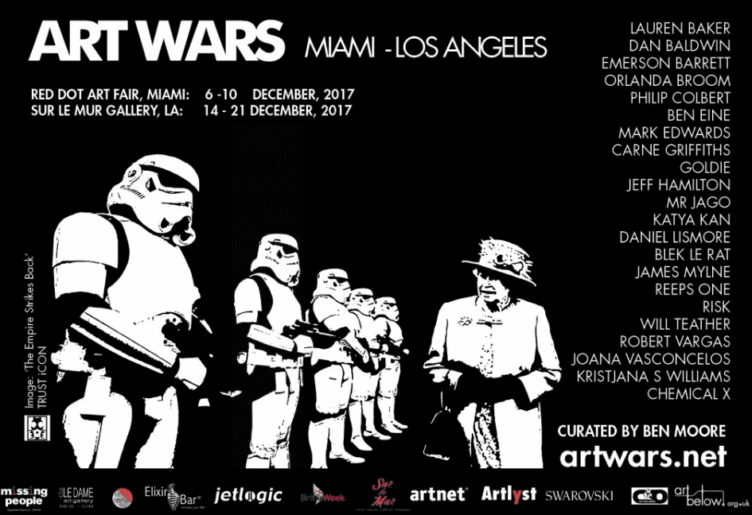

# Art Wars | AW

2007年，总部位于伦敦的艺术家兼策展人本·摩尔获得了两套白色冲锋队西装。

Ben没有简单地把它们作为艺术品保存下来，而是开始在伦敦各地佩戴它们，一个想法开始形成，艺术战争诞生了。

这是14年的旅程，我们很高兴有你一起去兜风！

**艺术大战侠盗一版**
**12月8日至22日**

为了配合最新的《星球大战》电影《侠盗1》的发布，包括阿尼什·卡普尔爵士在内的八位新兴和知名艺术家都为《星球大战》冲锋队头盔装饰了独特的设计。
参与的艺术家Anish Kapoor C.B.E.，D*Face，Dan Baldwin，Carne Griffiths，Agnetha Sjogren，Polina Vasenkova，Schoony和Miranda Donovan各自获得了冲锋队头盔，上面有艺术战争策展人Ben Moore的指示，“将黑暗面变成艺术的一面”。

## **“艺术大战”南广场**

**2016年2月2日至28日**

私人视角：2月2日（周二），下午6：00至晚上10：00

地点：间谍协会会员俱乐部，南广场酒店，3南广场，摩尔门，伦敦EC2M 2AF。

## **“艺术大战”洛杉矶**

**2016年1月27日至31日**

Art Wars前往洛杉矶，在那里我们在洛杉矶艺术展的艺术统一展位上有一个“存在”

[2016年1月27日至31日 | 洛杉矶会议中心 ](http://guestpasseslaas16.eventbrite.com/?utm_source=eb_email&utm_medium=email&utm_campaign=reminder_attendees_48hour_email&utm_term=eventname)大厅。

## **“艺术大战”拉斯维加斯**

**7th 一月 2016**

惠普星球大战主题派对

投降夜总会 – 3131 S 拉斯维加斯大道， 拉斯维加斯， NV 89109

## **“艺术大战”梅费尔**

**2015年12月18日至2016年1月17日**

随着备受期待的《星球大战》系列的最新作品在英国各地的电影院上映，伦敦的艺术策展人本·摩尔（Ben Moore）和萨拉·韦德（Sara Wade）在梅费尔（Mayfair）市中心推出了一个回顾展“艺术战争”。

“梅费尔艺术大战”将于12月17日在梅费尔赫特福德街18号开幕，届时将带领参观者深入了解近十年的艺术，与艺术界一些最优秀的人才合作，他们将星球大战文化与自己的艺术风格和商标风格融为一体。

艺术家包括Mr.Brainwash，James Mylne，Hayden Kays，Jake and Dinos Chapman，Alison Jackson和Joe Rush。

## **“艺术战争”瑞典**

**2015年1月17日至3月29日**

艺术战争瑞典，2015年1月17日至3月29日。
3：e 瓦宁根艺术中心，卡内基糖精炼厂，哥德堡。

由Ben Moore和Olof Persson策展。

参展艺术家：夏洛特·吉伦哈马尔、马科德·林德、卡尔·迈克尔·冯·豪斯沃尔夫、卡罗来纳·法尔霍尔特、托比亚斯·伯恩斯特鲁普、贝娅·森菲尔德、彼得·约翰逊、琳达·斯帕曼、约翰内斯·尼霍尔姆、玛丽亚·米森伯格、克里斯蒂安·帕托斯、艾琳·维克斯特伦、多尔娜·沙哈贝丁·阿斯兰扎德、艾斯法尔、安德烈亚斯·R·安德森、萨拉·洛·阿夫·埃肯斯塔姆、帕尔·斯文森、拉德米拉·克涅泽维奇、艾格妮莎·舍格伦、埃里克·伯格林

## **“艺术大战”绰号**

**2014 年 10 月**

包括Mr.Brainwash，Inkie，RYCA，Joe Rush，Elmo Hood，Schoony，Nancy Fouts和Craig Davison在内的一系列新艺术家已经将“黑暗面转变为艺术面”，将在今年的绰号艺术博览会上亮相。由Ben Moore策划的这些艺术家被特别邀请来实现绰号艺术博览会中集中体现的“城市氛围”。 

## **萨奇画廊的“艺术战争”**

**2013 年 10 月**

由Ben Moore策划的Art Wars是一个冲锋队头盔的展览，这些头盔一直任由艺术界的一些最好的人摆布，包括Damien Hirst，Jake and Dinos Chapman，Mr. Brainwash，D*Face和Joana Vasconcelos。

Art Wars于2013年10月在Saatchi画廊揭幕，并在整个月的Regent's Park Station上由Art Below在广告牌海报上展出。

2013年是本的兄弟汤姆失踪的第10个年头。萨奇画廊（Saatchi Gallery）的艺术战争展览和拍卖会的收益将捐给“失踪的汤姆”基金，该基金专门用于筹集资金以支持寻找托马斯·摩尔（Thomas Moore）。
