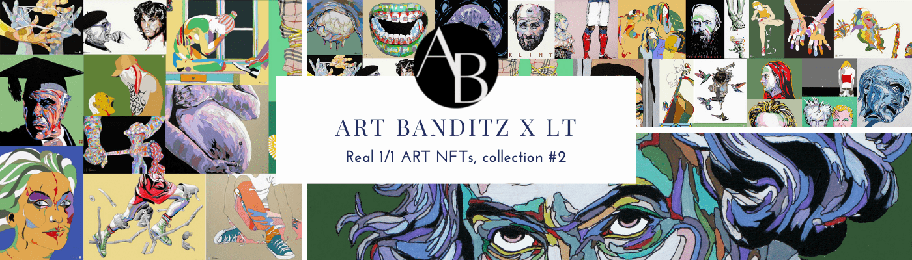

# Art Banditz X LT

Artbanditz x LT 是一个限量系列，只有 60 件独特的作品。 LT 是一位非常了不起且才华横溢的画家（油画和丙烯画），他以经典作曲家的肖像开始了他的旅程。 他的肖像受到高度赞赏，并出现在世界各地的杂志、书籍封面和古典音乐节上。 他有一种奇怪而新鲜的POP-ART风格。艺术家说：我的第一幅画是古典作曲家的肖像。 这些给我带来了国际上的成功。 在作曲家的冒险之后，我发现我的风格演变成波普艺术绘画的新鲜风格。 我在世界各地举办了许多令人惊叹的展览，尤其是向电影界的一些真正伟大的名人出售画作。 现在，生活让我与 ArtBanditz 面对面。 我真的很喜欢他们的匿名处理方式，因为我自己是一个奇怪的内向者。 此外，明年夏天将在一个国际电影节上举办一场大型合作，并邀请一位屡获殊荣的电影导演。

