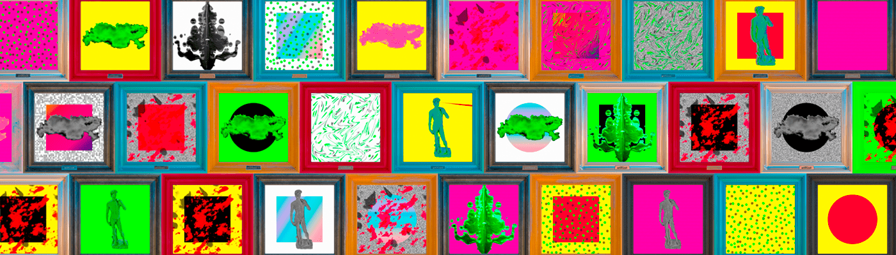

# artBloots

收集 3080 个独特的 1/1 带框 artBloots，可挂在 Bloot 虚拟世界的建筑物墙壁上。 大概什么都没有……

这个项目致力于艺术块。块上的每个面板都是一个小型的生成艺术作品，具有几个随机参数，它们过着自己的生活，同时也是作品的一部分。这象征着由 ArtBlocks 的共同理念联合起来的生成艺术家。每幅艺术作品都包含一个单词 ART BLOCKS 的字母。拥有所有九个字母的收藏家成为TBOA俱乐部的成员。

▶ artBloots 的 The Blocks of Art 是什么？

artBloots 的 The Blocks of Art 是一个 NFT（不可替代令牌）集合。存储在区块链上的数字艺术品集合。

▶ artBloots的 The Blocks of Art 代币有多少？

artBlootsNFT 总共有 500 个 The Blocks of Art。目前，187 位所有者的钱包中至少有一本 artBloots NTF 的 The Blocks of Art。

▶ artBloots 的 The Blocks of Art 最近卖出了多少？

过去 30 天共售出 0 个 artBlootsNFT 的 The Blocks of Art。

