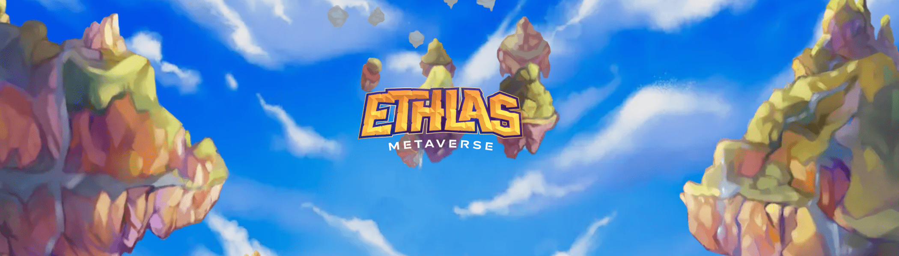

# Artefacts by Ethlas

EthlasArtefacts 的 Artefacts 赋予游戏内实用程序和能力，例如增加矿石掉落、皮肤修改等等。 立即收集您的文物！

Ethlas NFT 的人工制品在过去 7 天内售出 3 次。Ethlas 的 Artefacts 的总销售额为 137.23 美元。Ethlas NFT 的一件 Artefacts 的平均价格为 45.7 美元。Ethlas 所有者拥有 248 件人工制品，总供应量为 644 个代币。

Ethlas NFT 的人工制品 - 常见问题 (FAQ)

▶ Ethlas 的人工制品是什么？

Ethlas 的 Artefacts 是一个 NFT（不可替代令牌）集合。存储在区块链上的数字艺术品集合。

▶ Ethlas 代币存在多少 Artefacts？

Ethlas NFT 总共有 644 个人工制品。目前，248 位所有者的钱包中至少有一件 Ethlas NTF 的 Artefacts。

▶ Ethlas 出售的最昂贵的 Artefacts 是什么？

Ethlas NFT 出售的最昂贵的 Artefacts 是 [Tesseract #195](https://www.nft-stats.com/asset/0xcaa4456c691700f2d45637d5bbd310d4742ba450/195)。它于 2022-06-30（大约 2 个月前）以 54.9 美元的价格售出。

▶ Ethlas 的 Artefacts 最近卖出了多少？

在过去 30 天内，Ethlas NFT 售出了 5 件 Artefacts。

