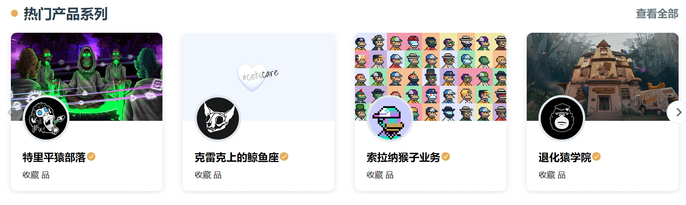
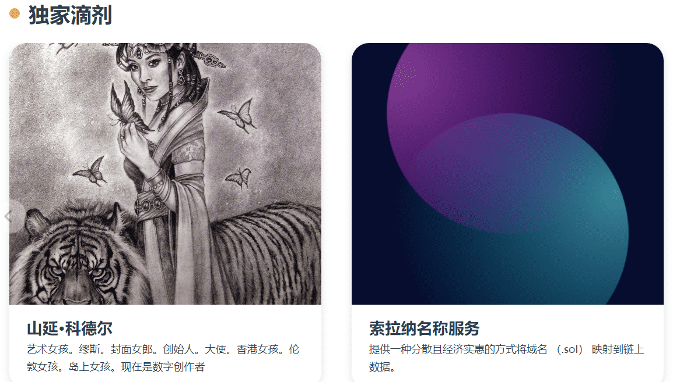
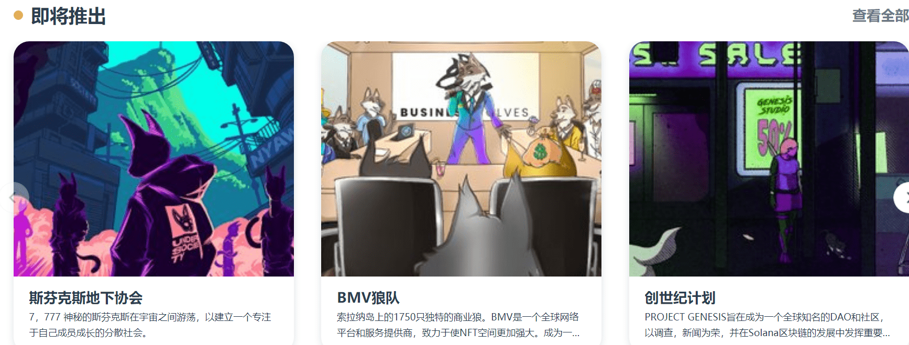

# Artemis Market

**Artemis**正在构建元元访问和实用性的核心基础设施。我们是世界上第一个移动优先的跨链NFT社交和交易平台，将成熟的现实生活品牌和产品带到Metaverse。

#Mobile - Artemis是一个移动的第一个平台，将允许通过我们的iOS和Android上的应用程序。

#SocialFi- Artemis努力成为一个全面的SocialFi套件，具有友好且易于使用的界面。我们自己的应用程序内社交社区使用户能够在一个地方完成FT发现价值链，允许用户发现、讨论、共享和展示他们的NFT。

#Crosschain - Artemis Market目前是唯一一个同时是EVM和Solana的NFT市场兼容。

#Metaverse - Artemis bridges建立了品牌和现实生活中的产品，已经与爱马仕合作，戈尔丁拍卖。沃森的葡萄酒。

#AAA - Artemis目前由阿拉米达、阿尼莫卡和阿里巴巴的家庭办公室提供支持。

由于我们的联合创始人是前高盛MT投资银行家，加上由20名开发人员组成的强大团队，我们非常适合将web3带到下一阶段。

