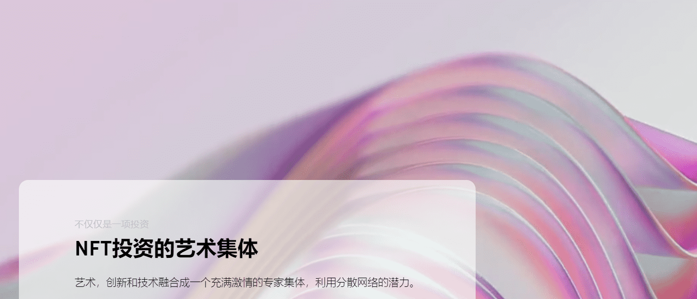
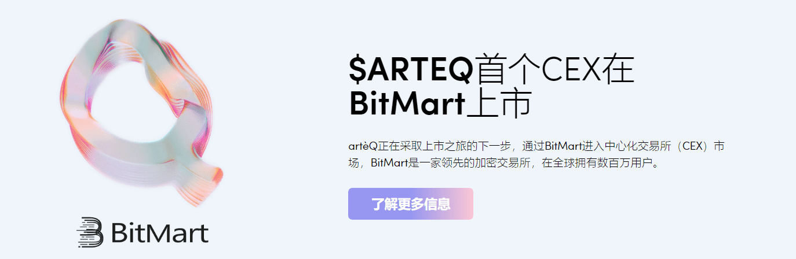
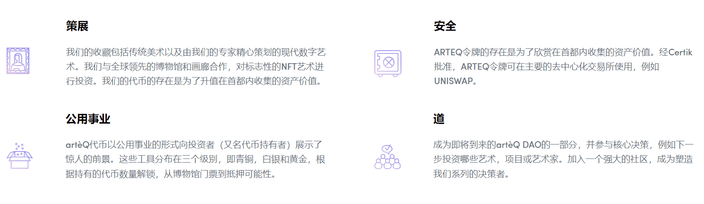

# artèQ

artèQ拍卖行在独家虚拟环境中收集了精选的模拟和数字艺术作品，交易基金收藏。这是一个开创性的FT市场，具有独特而创新的特性和功能，如基于以太坊区块链的分数NFT和资产投递，并准备在其他区块链上推出。

artèQ拍卖行是一个强大的在线平台，NFT艺术在这里出售。artèQ使用最先进的技术，将模拟和数字艺术杰作汇集在独家虚拟环境中。与大多数NFT市场不同，artèQ还不是公共拍卖行。

为了在拍卖平台上展示，艺术品需要进行选择过程，只选择最好的作品。通过这样做，artèQ保证平台上可用的每件艺术品都符合高质量标准。

artèQ拍卖行是市场上最好的NFT的窗口。

# 它是如何运作的

1.

我们找到最有动力的最佳项目和艺术品。

2.

以最优惠的价格购买或合作项目

3.

保护区块链上的资产并创建NFT

4.

根据项目类型在各种合作伙伴平台上启动。

# 成为 artèQ 艺术家

# 为什么要投资 artèQ

艺术，创新和技术融合成一个充满激情的专家集体，利用区块链的潜力使艺术投资民主化。我们期待了解您和您的艺术作品！立即提交您的模拟、数字或 NFT 艺术品，并抓住机会在我们的认证拍卖行上成为未来。
