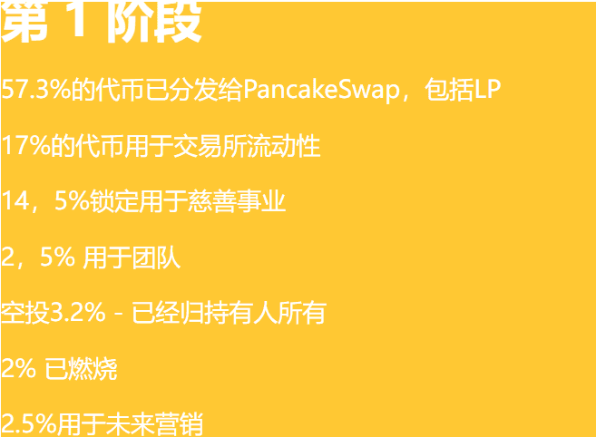
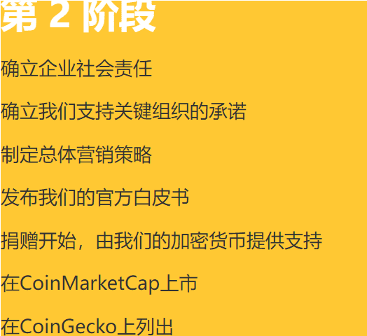
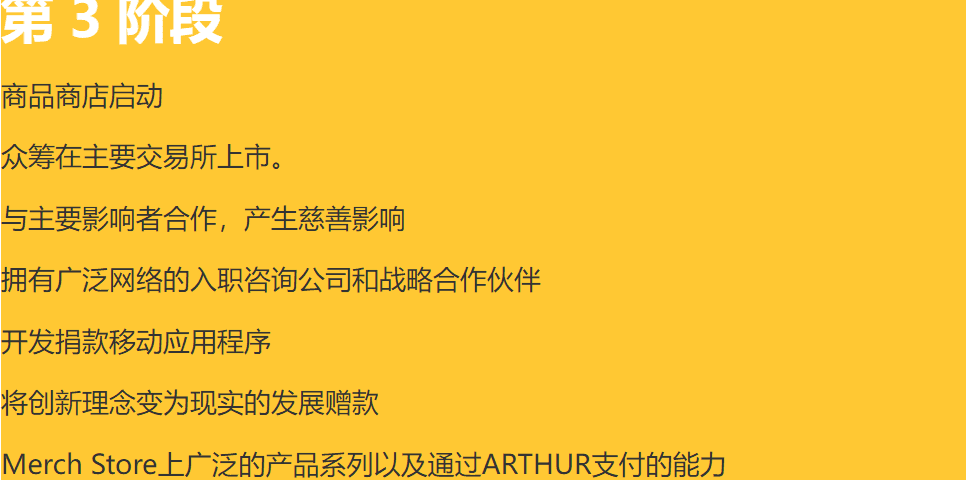

# ArthurBear

ArthSwap是一个一站式Defi On Astar网络。

我们的使命是为Astar Network生态系统的扩展做出贡献。

具有简单的Ul和设计高APY，它可以在Astar网络上实现高频交易。

我们专注于Astar网络生态系统的增长，并愿意优化Astar的所有元素，因此我们认为自己是一个“Astar原生”的dApp。

大自然迫切需要我们的帮助。野生动物，从鸣禽到蝴蝶，从灵长类动物到熊，正在迅速消失，以至于它们可能与长期维持它们的野生森林，草原和其他栖息地一起永远消失。

我们人类已经使用地球上近一半的土地来维持我们自己，以及其中最有生产力的部分。未来的挑战不小，但通过我们的农场和城市，共享的景观和大片的野生地区共同努力，我们可以使我们星球的自然再次变得完整和健康。

## **交易者**

**初始费用为2.2%，2%将根据每个钱包中$ARTHUR代币的数量按比例重新分配给所有持有者，0，2%将被烧毁。**

ARTHUR令牌是在PancakeSwap上列出并激励的加密货币令牌。

很快，我们将进入TOP 10分散式交易所

## **支架**

**ARTHUR是野生动物分散自发社区建设的一个例子。**

ARTHUR令牌是我们的第一个令牌，允许用户持有它，并在每笔交易中按比例获得2%。这个BEP-20 ONLY令牌交换并保存在池中，将有助于未来捐赠的增长.

## 生态系统

**Arthur是一个令牌，其智能合约部署在币安智能链上。**

此外，我们平台上14.5%的存款代币将用于非营利组织的慈善事业，以保护野生动物。

我们的捐款将有捐款证明，并将被用户跟踪。

