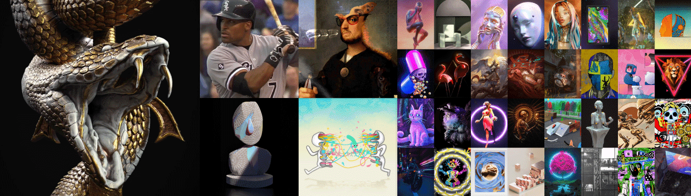

# Artifex

Artifex 项目通过 1/1 原创艺术品和 3D 雕塑版 NFT 的集合来表彰数字艺术家，并为过滤器、元节等提供路线图。 定制和黄金标准的智能合约。 每次购买都附带一个启用 3D 显示的 RareRooms 画廊。

Artifex NFT - 常见问题（FAQ）

▶ 什么是 Artifex？

Artifex 是一个 NFT（不可替代代币）集合。存储在区块链上的数字艺术品集合。

▶ 有多少 Artifex 代币？

总共有 Artifex NFT。目前 0 位所有者的钱包中至少有一个 Artifex NTF。

▶ 最近卖出了多少 Artifex？

过去 30 天内售出了 0 个 Artifex NFT。

▶ 什么是流行的 Artifex 替代品？

许多拥有 Artifex NFT 的用户还拥有 [Grassetti 的 Meme Kingdom](https://www.nft-stats.com/collection/grassetticollection)、 [Blockparty x NFTSEA 2022](https://www.nft-stats.com/collection/blockparty-x-nftsea-2022)、 [Ash Chapter 2: Metamorphosis](https://www.nft-stats.com/collection/ashmetamorphosis)和 [NessGraphics](https://www.nft-stats.com/collection/nessgraphics)。

