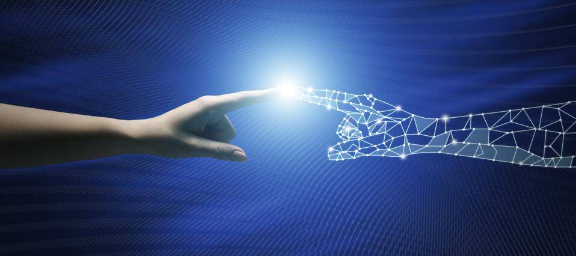

# Artifical Mind | AI

通过使用由四位人工智能专家构建的算法，Artifical Mind 被开发出来。 这个项目想要描述人类思维无法理解或承受的愿景。

人工思维 | AI NFT - 常见问题（FAQ）

▶ 什么是人工思维 | 人工智能？

人工思维 | AI 是一个 NFT（Non-fungible token）集合。存储在区块链上的数字艺术品集合。

▶ 多少人工心智 | AI代币存在吗？

总共有 5,555 个人工思维 | 人工智能 NFT。目前 596 位拥有者至少拥有一个人工思维 | AI NTF 在他们的钱包里。

▶ 什么是最昂贵的人工大脑 | 人工智能销售？

最昂贵的人工大脑 | 出售的 AI NFT 是 [Artifical Mind](https://www.nft-stats.com/asset/0x860826f570a0a09cc3453fb8a884700fca008d34/1300)。它于 2022 年 6 月 19 日（2 个月前）以 0 美元的价格出售。

▶ 多少人工心智 | 最近卖AI了？

有 2 种人工思维 | 过去 30 天内售出的 AI NFT。

▶ 什么是流行的Artificial Mind | 人工智能替代品？

许多拥有Artifical Mind的用户| AI NFT 还拥有 [PixelElfs](https://www.nft-stats.com/collection/pixel-elfs)、 [Pictograph Stomach Ache](https://www.nft-stats.com/collection/pictograph-stomach-ache)、 [Character Design Official](https://www.nft-stats.com/collection/character-design-official)和 [LilBabyMews](https://www.nft-stats.com/collection/lilbabymews-1)。

