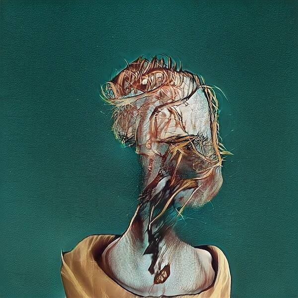

# Artificial Apes

一个以人工智能猿为特色的社区驱动的收藏品项目。 人工猿是通过一个秘密酱汁 AI 引擎生成的，最大集合大小为 1,000。 每个 Ape 都允许其所有者对社区的治理、艺术的执行以及前往月球的宇宙飞船的方向进行投票。

人工猿 NFT - 常见问题（FAQ）

▶ 什么是人工猿？

人工猿是一个 NFT（不可替代令牌）集合。存储在区块链上的数字艺术品集合。

▶ 人工猿代币有多少？

总共有 400 个人工猿 NFT。目前，112 位车主的钱包中至少有一个人工猿 NTF。

▶ 最近卖出了多少人造猿？

过去 30 天内共售出 0 个人工猿 NFT。

