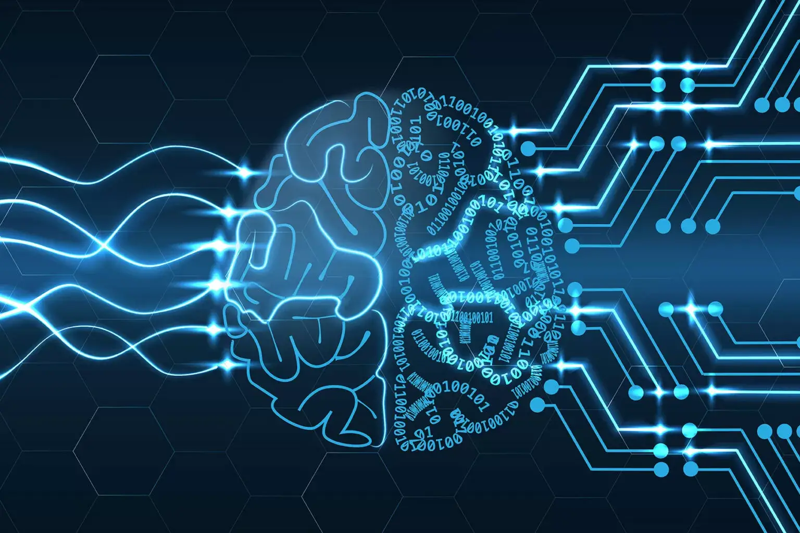

# Artificial by Design V2

我在过去 5 个月中创作的 AI 作品集，大小和场景描绘不等。 希望您能看到它们之间的进展和差异。 真的很高兴能把这些拿出来并展示人工智能的真正能力......on/artificial-by-design-v2

基于各种文本提示的 AI 生成艺术集合，我将在每件作品的描述中包含我使用的提示。这些是我分享的第一批作品，刚刚被人工智能艺术的可能性所震撼。我希望你喜欢它们。

人工设计 NFT - 常见问题 (FAQ)

▶ 什么是人工设计？

人工设计是一个 NFT（不可替代令牌）集合。存储在区块链上的数字艺术品集合。

▶ 存在多少人工设计代币？

总共有 4 个人工设计的 NFT。目前有 2 位所有者的钱包中至少有一个人工设计的 NTF。

▶ 最近卖出了多少Artificial by Design？

在过去 30 天内售出了 0 个人工设计 NFT。

BUY_NOW)

