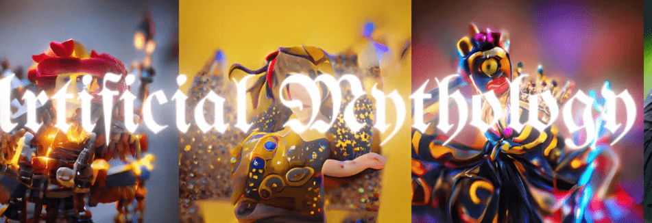

# Artificial Mythology

Artificial Mythology 在过去 7 天内售出 3 次。Artificial Mythology的总销售额为 63.31 美元。一个 Mythologicals NFT 的平均价格为 21.1 美元。有 402 名 Mythologicals 所有者，拥有 1,000 个代币的总供应量。

神话是生活在以太坊区块链上的 1000 种 GAN 生物，由地球上的一群艺术家创建。代表人类和人工智能最早的融合，同时在未来的创造方法和古代生物之间建立联系，这些生物背后的创造故事和世界各地和整个时代的文化神话。（后续步骤即将推出）oncyber.io/mythologicals https://discord.gg/zGP8uMzDfg

