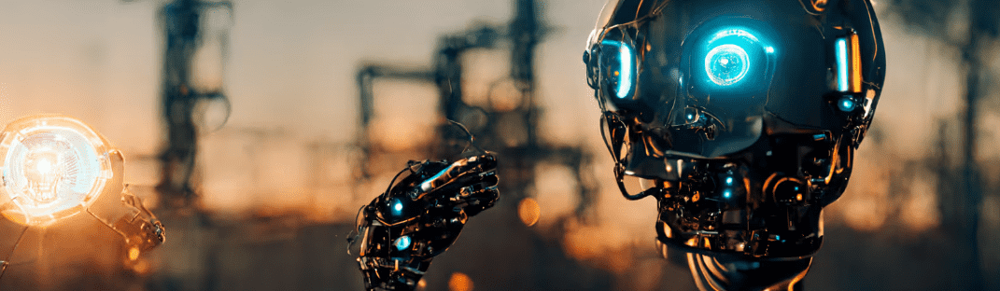

# Artificially Intelligent Artworks

我喜欢用人工智能引擎创作的艺术作品集。反映我自己最喜欢的作品。 希望你和我一样喜欢它们。

人工智能艺术品 NFT 在过去 7 天内售出 1 次。人工智能艺术品的总销售额为 10.98 美元。一件人工智能艺术品 NFT 的平均价格为 11 美元。有 99 位人工智能艺术品所有者，总共拥有 28 个代币。

我喜欢用人工智能引擎创作的一系列艺术品。

反映了我自己最喜欢的作品。希望你和我一样喜欢它们。

人工智能艺术品 NFT - 常见问题 (FAQ)

▶ 什么是人工智能艺术品？

人工智能艺术品是一个 NFT（不可替代令牌）集合。存储在区块链上的数字艺术品集合。

▶ 有多少人工智能艺术品代币？

总共有 28 个人工智能艺术品 NFT。目前，99 位所有者的钱包中至少有一个人工智能艺术品 NTF。

▶ 最昂贵的人工智能艺术品拍卖会是什么？

售出的最昂贵的人工智能艺术品 NFT 是 [The Pope Is Dead](https://www.nft-stats.com/asset/0x9cf0134050ce4b376529e69b32aff4a26463e42a/29896125667398295280649501048946195559498857907782391680146218304644310892547)。它于 2022-07-02（大约 2 个月前）以 11 美元的价格售出。

▶ 最近卖出了多少人工智能艺术品？

过去 30 天内共售出 1 件人工智能艺术品 NFT。

