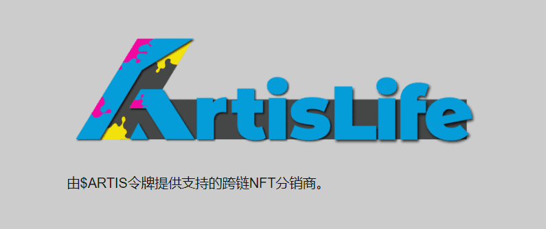
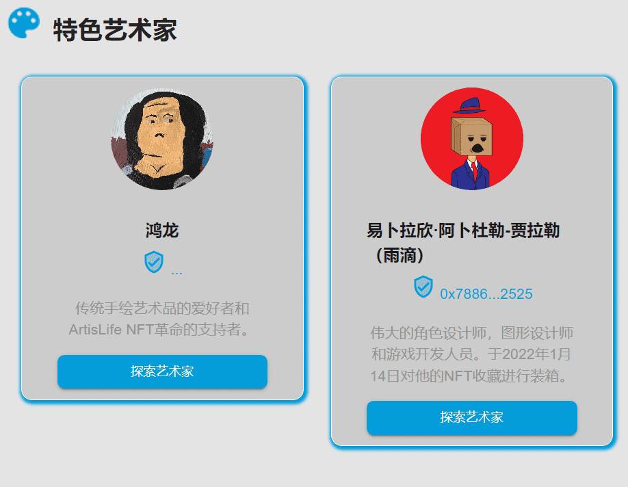
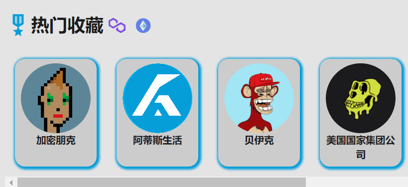

# ArtisLife Network

NFT农业、NFT彩票、NFT空投等！每种分发方法都使用SARTIS令牌形式。

SARTIS代币持有人决定了网络的未来。

英国《金融时报》市场，费用低1.5%。费用用于回购和烧毁$ARTIS。

新泽西州的程序员和艺术家Inzhagi最近一直在磨练她在像素艺术方面的技能。

作为Girls Who Code的校友和有抱负的区块链开发人员，她希望利用自己的艺术在充满幻想的世界中揭示真相。
