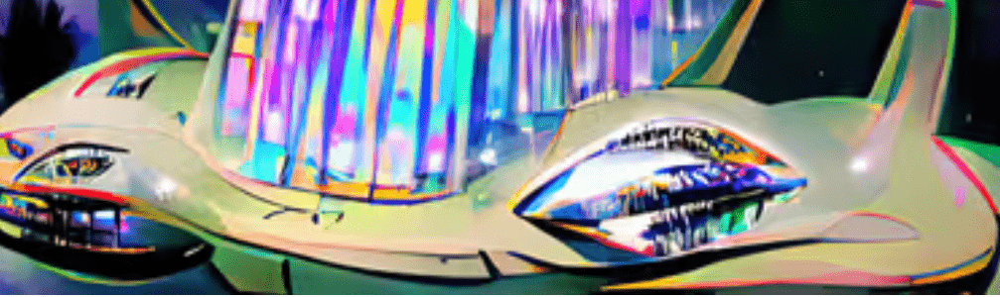

# Artistic Spaceships

艺术宇宙飞船是以太坊区块链上的宇宙飞船集合。

Artistic Spaceships 的艺术之爱是独特的 NFT 艺术的集合，所有这些都是通过使用数字画笔进行的数字绘画完成的，并且无法重新创建，每件作品只有 1 件是铸造的。

正如一位所有者所说的那样完美，可以用作手机屏幕保护程序或背景图像，因此他每天都能看到它。

新铸币厂的底价将上涨，当铸币的 50% 售出时，将有更多的铸币用于收藏，除非它是定制的 NFT

当收藏达到 10 个持有者时，每个持有者将免费获得更多信息

这个系列是在流行的多边形数字艺术系列https://opensea.io/collection/digital-art-13之后创建的，越来越多的人要求收集 ETH，所以就在这里。

在虚拟画廊中查看 ETH 和多边形艺术的收藏https://oncyber.io/digitalartgallery

我做定制数字艺术，在推特上给我发一个 DM，告诉我一个想法，我会尝试为你创造一个独特的艺术作品

请在 Twitter 和 Instagram 上关注我

