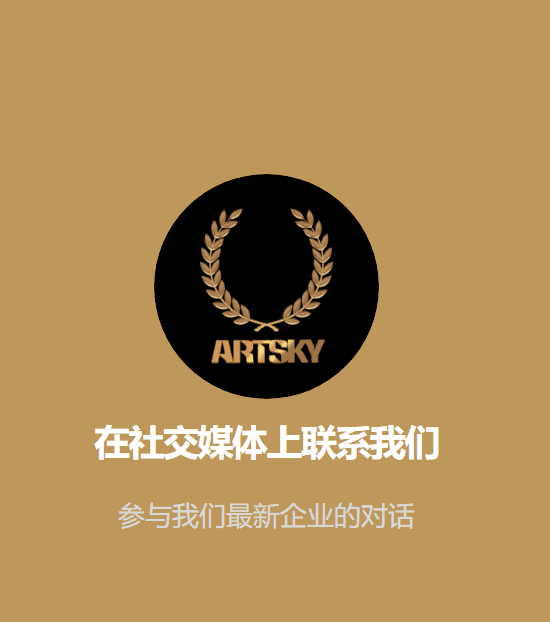

# ARTSKY

ARTSKY是新冠肺炎后新世纪的一项新创新，我们正处于对互联网的依赖程度。是时候用创意赚钱，并在一个分散的平台上出售它们了，该平台在没有第三人称的情况下直接连接买家和卖家。

NFT预计将扰乱许多行业，我们认为创造经济行业就是其中之一。有许多不可复制的类别，如重力、音乐、视频、绘画、数字艺术、徽标、域名、照片、个人资料、商品、角色、体育等。这就是为什么我们创建了Artsky NFT，这是一个分散的社交媒体FT平台，以帮助粉丝与他们最喜欢的人建立真正的关系。

然而，在当今的数字时代，随着当前人力资源人才的发展，艺术世界正在扩大。艺术已经扩展到游戏、Metaverse和金融领域。

比特币、以太坊及其所有衍生产品现已证明了基于金融的权力下放。最初仅基于资产交付的发展现已扩展到其他商业世界。

称之为DeFi（分散式金融），这是金融界的一个分散式发展，是开源和非监管的流动性协议，用于赚取存款和借入资产的利息。

然后，它再次发展到英国《金融时报》市场，这是平面设计艺术家新世界的先驱，他们可以直接在平台上销售作品，而无需第三方的参与，第三方通常对他人的作品获得至少10%的利润。

进一步的发展将导致Metaverse，这是一个庞大的3D世界和实时模拟网络，不断渲染并支持身份、对象、历史、付款和权利的连续性，并且可以由无限数量的用户同时体验，有效地。

与个人的每一次存在感。

