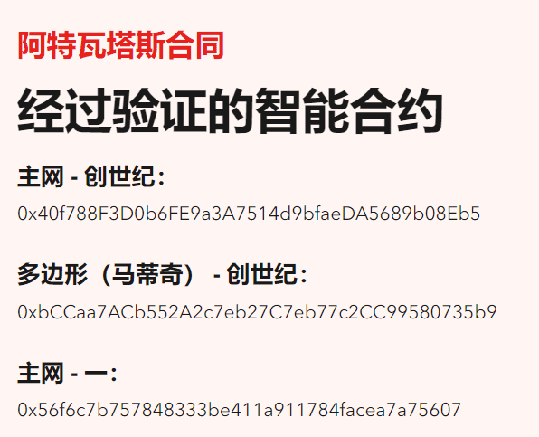
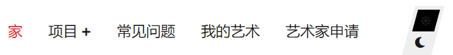

# Artvatars

Artvatars是一个新项目，它将彻底改变收藏家购买和收集NFT的方式。

Artvatars是与60多名世界上最好的CryptoArtists合作创作的，是一件罕见的艺术品。

祭坛由每个艺术家的艺术品组成，这些艺术品被拼接成各种组件。然后，我们的Al算法随机分配生成Artvatar的部分，并创建一个最终的唯一NFT。Artvatars在这里为您带来下一代独家数字艺术收藏品。

现在，凭借我们独特的技术，每个收藏家都可以以极高的价值拥有稀有的1/1英尺。

# 哈维尔·阿雷斯

哈维尔·阿雷斯（Javier Arrés）是世界知名艺术家，也是2019年伦敦艺术双年展的获奖者。除了在伦敦获奖外，他还获得了2017年伦敦插画人物选择奖，他还获得了2020年在佛罗伦萨举行的莱昂纳多达芬奇国际奖。哈维尔·阿雷斯（Javier Arrés）已经在许多国家展出，包括巴黎，伦敦，曼彻斯特和新加坡。

Arrés Arres具有独特的风格和高识别价值，并在童年故居俯瞰家乡和其中美丽建筑的广阔视野中寻找灵感。

