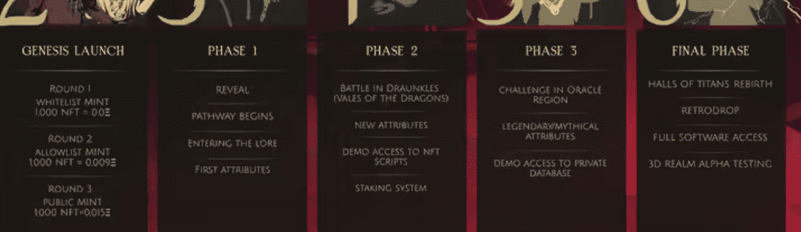

# EtMG

欢迎来到EtMG！

注意：所有通行证的期限为永久。

Origins 的价值在于通过教育、资源、深入了解来为我们的成员带来更多的视角。作为积极的 NFT 投资者，我们明白在千变万化的市场中是十分困难的。

因此，创建这个社区是为了让志我们同道合的人加入、学习、合作，并成为更好的投资者。欢迎你随时到访我们的 Discord 频道。

起源 EtMG- 常见问题（FAQ）

▶ 什么是EtMG- CN？

Origins EtMG - CN 是一个 NFT（不可替代代币）集合。存储在区块链上的数字艺术品集合。

▶ OriginsEtMG - CN 代币有多少？

总共有 1 个 Origins EtMGT - CN NFT。目前 183 位所有者的钱包中至少有一个 Origins NFT - CN NTF。

▶ 什么是最昂贵的 EtMG CN 销售？

最昂贵的 Origins EtMG NFT 是 [Origins (Chinese) NFT Access Pass](https://www.nft-stats.com/asset/0x495f947276749ce646f68ac8c248420045cb7b5e/63763212585141476199723449601564140078511354041472126739157516505583445869544)。它于 2022 年 6 月 8 日（3 个月前）以 150 美元的价格售出。

▶ 最近卖出了多少 Origins EtMG CN？

过去 30 天内售出了 3 个 Origins EtMG NFT。

▶ 什么是流行的 Origins EtMG CN 替代品？

许多拥有Origins EtMG NFTs的用户也拥有 [别碰我的脸颊！](https://www.nft-stats.com/collection/don-t-touch-my-cheek), [MeOwMeoW Save My Life](https://www.nft-stats.com/collection/meowmeow-save-my-life) , [Naminori](https://www.nft-stats.com/collection/naminori)和 [MemeBirds V1 贬值](https://www.nft-stats.com/collection/memebirds-v1)。

