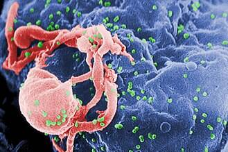

# ARV V2

让我们在 2025 年之前种植 1000 万棵树，并将每一棵树都变成 NFT，这完全取决于您。 每个令牌都有纬度、经度和物种。 了解更多：https://arv.green/。

ARV V2 NFT - 常见问题（FAQ）

ARV V2 特征

▶ 什么是 ARV V2？

ARV V2 是一个 NFT（不可替代代币）集合。存储在区块链上的数字艺术品集合。

▶ 有多少 ARV V2 代币？

总共有 1,000 个 ARV V2 NFT。目前 3 位所有者的钱包中至少有一个 ARV V2 NTF。

▶ 最近卖出了多少 ARV V2？

过去 30 天内售出 0 个 ARV V2 NFT。

