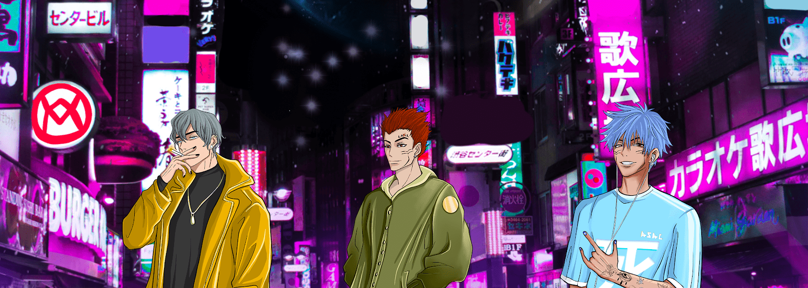

# Anti Social Anime Club (Official)

5000名伤心少年齐聚东京成立反社会动漫俱乐部

反社会动漫俱乐部（官方）NFT - 常见问题（FAQ）

▶ 什么是反社会动漫俱乐部（官方）？

Anti Social Anime Club (Official) 是一个 NFT (Non-fungible token) 集合。存储在区块链上的数字艺术品集合。

▶ Anti Social Anime Club (Official) 代币有多少？

总共有 928 个反社交动漫俱乐部（官方）NFT。目前 220 位车主的钱包中至少有一个 Anti Social Anime Club (Official) NTF。

▶ Anti Social Anime Club (Official) 最贵的促销是什么？

售出的最昂贵的 Anti Social Anime Club（官方）NFT 是 [Anti Social Anime Club #93](https://www.nft-stats.com/asset/0xe3a1ba661eb9107423390ebe35e7308084a96990/93)。它于 2022-06-13（2 个月前）以 2.5 美元的价格售出。

▶ 最近卖出了多少反社会动漫俱乐部（官方）？

过去 30 天内共售出 1 个 Anti Social Anime Club (Official) NFT。

▶ 什么是流行的反社交动漫俱乐部（官方）替代品？

许多拥有 Anti Social Anime Club (Official) NFTs 的用户还拥有 [CartoonzKi](https://www.nft-stats.com/collection/cartoonzki)、 [GaiaEliteClub](https://www.nft-stats.com/collection/gaiaeliteclub)、 [MetaGods Celestial Pass](https://www.nft-stats.com/collection/celestial-pass)和 [Toy Boogers 特别版](https://www.nft-stats.com/collection/toyboogers-special)。

