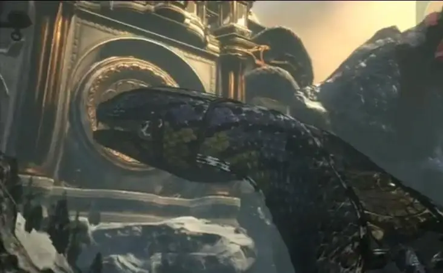

# Ascended Snakes

以太坊丛林中的 222 条转基因蛇CC0 // 0% ROYALTIES

Ascended Snakes NFT - 常见问题（FAQ）

▶ 什么是升蛇？

Ascended Snakes 是一个 NFT（不可替代代币）集合。存储在区块链上的数字艺术品集合。

▶ 有多少 Ascended Snakes 代币？

总共有 222 个 Ascended Snakes NFT。目前，55 位所有者的钱包中至少有一个 Ascended Snakes NTF。

▶ 什么是最昂贵的 Ascended Snakes 销售？

最昂贵的 Ascended Snakes NFT 是 [Ascended Snake #70](https://www.nft-stats.com/asset/0x9c1f05f8d38c389de0ce840919cb3114acc9ad23/70)。它于 2022-06-09（3 个月前）以 18 美元的价格售出。

▶ 最近卖出了多少条飞蛇？

过去 30 天内售出了 5 个 Ascended Snakes NFT。

