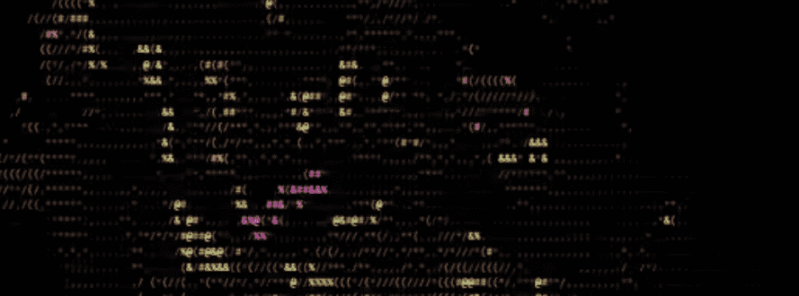

# ASCII Apepe

免费薄荷系列。 由@rareapepeyc 的退化收集者创建。 与原项目无关。

ASCII Apepe名称标签 NFT - 常见问题 (FAQ)

▶ 什么是 ASCII ApepeI 名牌？

ASCII Nametag 是一个 NFT（不可替代令牌）集合。存储在区块链上的数字艺术品集合。

▶ 有多少个 ASCII Apepe 令牌？

总共有 5,029 个 ASCII 名称标签 NFT。目前 2 位所有者的钱包中至少有一个 ASCII Nametag NTF。

▶ 最近卖出了多少个ASCII Apepe 名牌？

过去 30 天内售出 0 个 ASCII Apepe NFT。

\#ASCII 名称标签是使用“C”脚本编码为计算机语言的通用用户名。存储在区块链上，

它们为您在 Nametag 生态系统中的多钱包、跨链配置文件提供支持，让您可以将 NFT 带到网络上。

