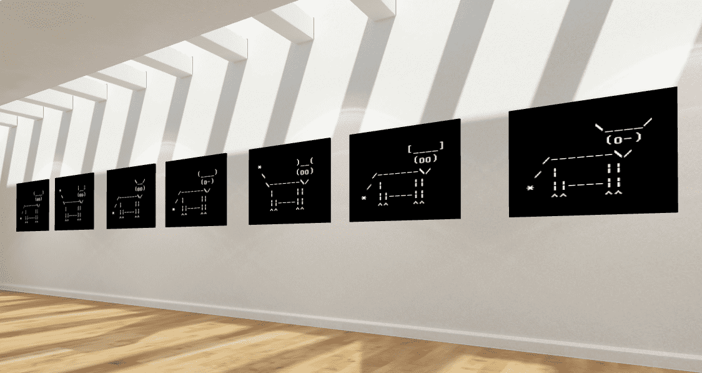

# ASCII Cows

访问图库——通过向合约发送 0.09 ETH 来铸造你自己的 ASCII Cow：0x700c5E8844fB7220084060A7d5dBB4b23677050D。 发送更多的 ETH 来铸造更多的奶牛。在互联网、电子邮件甚至新闻组的早期，没有图形终端，因此用户习惯于通过附加一些包含使用 ASCII 字符创建的视觉效果的文本行来签署他们的消息或帖子 他们可以使用的唯一绘画设备：键盘。 他们是早期的计算机艺术家。ASCII Cows NFT 是一组不可替代的代币，每个代币代表一头算法生成的独特奶牛。 在那些早期，Ascii 奶牛很受欢迎。 最多有 10080 头 ASCII 奶牛，每头都有不同的角、眼睛、脸、尾巴和脚的组合。 甚至牛的名字也是独一无二的。 奶牛使用老式 VGA 字体以黑白相间的方式绘制。

