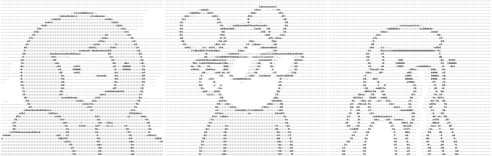

# Ascii Doodles

Ascii Doodles 是对所有 10,000 个 Ascii 形式的原始 Doodles 的 1:1 再现，包括元数据属性！

Ascii Doodles NFT - 常见问题（FAQ）

▶ 什么是 Ascii 涂鸦？

Ascii Doodles 是一个 NFT（不可替代令牌）集合。存储在区块链上的数字艺术品集合。

▶ 有多少 Ascii Doodles 代币？

总共有 3,278 个 Ascii Doodles NFT。目前，301 位所有者的钱包中至少有一个 Ascii Doodles NTF。

▶ 最近卖出了多少 Ascii Doodle？

在过去 30 天内售出 0 个 Ascii Doodles NFT。

过去 7 天没有出售任何 Ascii Doodle。

Ascii Doodles 是所有 10,000 个 Ascii 形式的原始 Doodles 的 1:1 再创作，一直到元数据属性！

