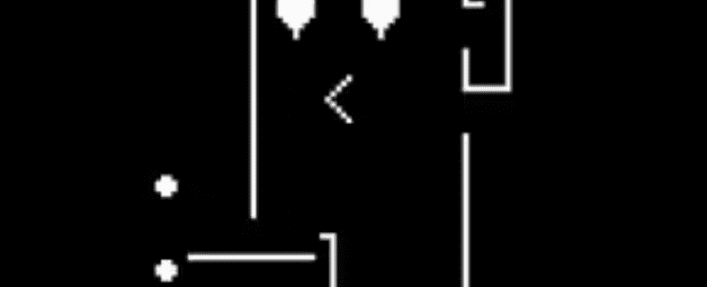

# ASCll Punks

ASCllPunks 收集了 1000 个 NFT，他们意识到我们今天交易和收集的许多 NFT 只不过是带有硬编码链接到包含元数据的集中式服务器的代币。 由于市场上有许多 NFT，您必须相信托管实际图像的人会信守承诺，在以太坊区块链的整个生命周期中托管艺术品。作为链上的最大化主义者，我发现信任中心化服务的想法 主持我拥有的艺术作品完全过于保管，并且与加密和去中心化的整体精神背道而驰。 只要代币本身不是与相关艺术密不可分，NFT 究竟能有什么价值？ 正是这个问题导致了 ASCIIPunks 的发展。因此，如果您是链上极简主义者、去中心化迷或真正的 OG 加密头，那么这就是您的项目。

