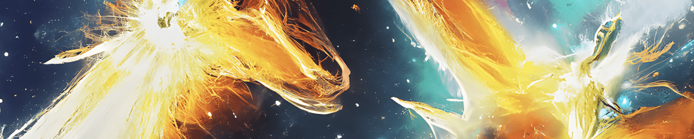

# Ash Realm

..从灰烬中，一个新的境界诞生了。

Ash Realm NFT - 常见问题（FAQ）

▶ 什么是灰域？

Ash Realm 是一个 NFT（不可替代代币）集合。存储在区块链上的数字艺术品集合。

▶ Ash Realm 代币有多少？

总共有 1 个 Ash Realm NFT。目前 5 位所有者的钱包中至少有一个 Ash Realm NTF。

▶ 最近卖出了多少灰域？

过去 30 天内售出 0 个 Ash Realm NFT。

灰烬是燃烧的结果，而衰变是一种化学燃烧反应。尽管可以看到背景图案的颜色，但存在变暗，这是衰变的开始。前景是象征“未来”的符号。毕竟，字母是符号。之所以对上面的灰符号来说很简单，是因为它已经采取了纯粹的形式。在Flame中，我们再次看到了腐烂的痕迹，但有轻微的红色。说到灰烬，我推荐王家卫的电影《时光的灰烬》，很深刻。每三天将增加 0.06 ETH，因为我正在处理另一个项目，在他的帮助下，这个神器真的会飞起来。顺便说一句，你好大卫林奇。坚持艺术与健康...

