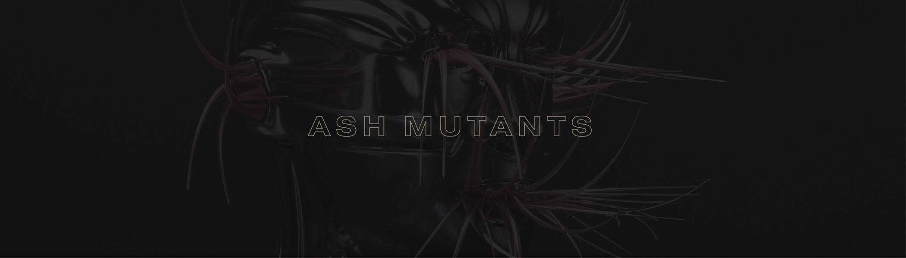

# ASH MUTANTS

突变体是那些已经转变的人。

ASH MUANTS NFT - 常见问题（FAQ）

▶ 什么是灰烬突变体？

ASH MUTATS 是一个 NFT（不可替代代币）集合。存储在区块链上的数字艺术品集合。

▶ 有多少个 ASH MUANTS 代币？

总共有 4 个 ASH MUANTS NFT。目前，24 位所有者的钱包中至少有一个 ASH MUANTS NTF。

▶ 最近卖出了多少 ASH MUTATS？

过去 30 天内售出 0 个 ASH MUANTS NFT。

灰烬突变体：变形金刚NFT在过去7天内卖出了100次。Ash Chapter 2: Metamorphosis 的总销售额为 $34.14k。一本《灰烬突变体：变形金刚》的平均价格为 341.4 美元。《灰烬突变体：蜕变》拥有者 2,295 人，总供应量 5,868 枚。

