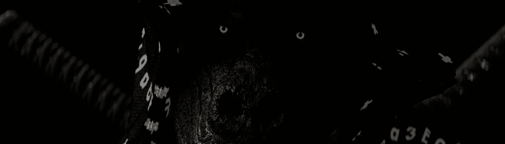

# Ash Walkers by Mwan

Welcome the Ash Walkers 是一系列步行角色，灵感来自 Murat Pak 的作品。 可在 ASH 代币中购买。 我们接受 ASH ！

Mwan NFT 的 Ash Walkers - 常见问题（FAQ）

▶ Mwan 的 Ash Walkers 是什么？

Mwan 的 Ash Walkers 是一个 NFT（非同质代币）系列。存储在区块链上的数字艺术品集合。

▶ 有多少个 Ash Walker by Mwan 代币？

Mwan NFT 总共有 3 个 Ash Walkers。目前，66 位车主的钱包中至少有一个 Mwan NTF 的 Ash Walkers。

▶ Mwan 的 Ash Walkers 最近卖出了多少？

在过去 30 天里，Mwan NFT 出售了 0 个 Ash Walkers。

▶ Mwan 的流行 Ash Walkers 替代品有哪些？

许多拥有 Mwan NFT 的 Ash Walkers 的用户也拥有 [NOISE](https://www.nft-stats.com/collection/noise-secondstate)， [俄罗斯入侵乌克兰：下一步是什么？](https://www.nft-stats.com/collection/wn001)[第 001 集](https://www.nft-stats.com/collection/wn001)， [holonick X Pepe](https://www.nft-stats.com/collection/holonick-x-pepe)和 [Lil Demonz NFT 官方](https://www.nft-stats.com/collection/lil-demonz-nft-official)。

