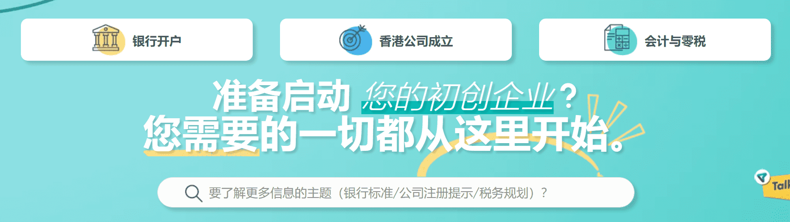
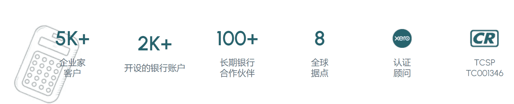
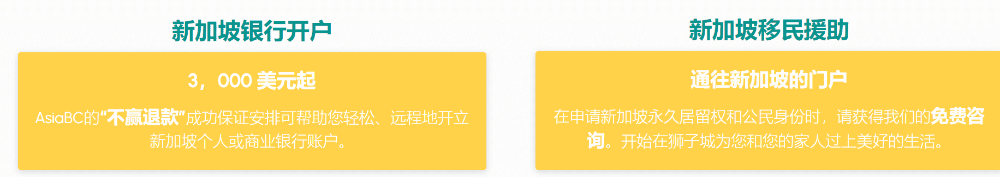

# AsiaBC

AsiaBC刚刚推出的是新的bep-20代币，用于设置和注册您的全新新加坡私人。

有限公司远程提供新加坡提名董事服务和本地注册地址，因此您无需在新加坡有任何存在。服务套餐费用将使用ABC令牌支付。

SG政府费用和1年代理服务。

*购买成本不收取任何费用，因此1%的下滑。

*24小时内卖出：32%烧毁（24%返还流动性池，8%重新分配给持有人）。

*在72小时内出售：28%烧毁（21%返回流动性池，7%重新分配给持有人）。

*在120小时内出售：24%的烧毁（18%回到流动性池，6%重新分配给持有人）。

*在168小时内出售：20%烧毁（15%退回流动性池，59英寸重新分配给持有人）。

*标准烧伤：16%烧伤（12%回到流动性池，4%重新分配给持有人）。

*每个钱包的最大金额：3,000,000,000。

*最大交易量：1,000,000,000。

是时候跳过漫长，可怕和疲惫的商务航班了，因为您可以以数字方式以数字方式出发您的[香港有限公司](https://asiabc.co/services/bank-account/hong-kong-corporate-bank-account-opening/)，只需1，050美元，包括所有政府费用和金钟着名的办公地址。停止拖延，开始点击。

与每个企业家的完美合作伙伴Xero一起顺利控制您的业务财务。

基于云的会计平台嵌入了 AsiaBC 的审计和税务安排，可让您随时随地高效地管理账单、发票和工资单。

您还将获得指定人员，使用Xero会计凭证监控和提交香港政府税。
