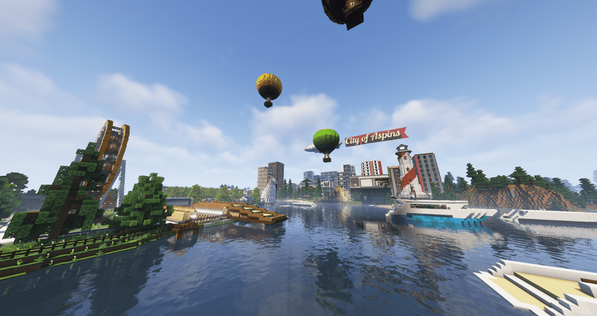

# Aspinverse

Aspinverse 是一个细分的 NFTWorld 元宇宙，Kool Aspins 和其他 NFT 一起生活在其中。 土地所有者可以在 128x128 平方块的土地上开发和建造任何他们能想到的东西。注意：共享边界块包含在 128x128 中。让我们一起建造 Aspinverse！Aspinverse Minecraft 服务器：aspinverse.koolaspins.xyzKool Aspins：https:// /opensea.io/collection/kool-aspins

Aspinverse NFT - 常见问题（FAQ）

▶ 什么是 Aspinverse？

Aspinverse 是一个 NFT（不可替代代币）集合。存储在区块链上的数字艺术品集合。

▶ 有多少 Aspinverse 代币？

总共有 29 个 Aspinverse NFT。目前，14 位所有者的钱包中至少有一个 Aspinverse NTF。

▶ 最近卖出了多少 Aspinverse？

过去 30 天内售出了 3 个 Aspinverse NFT。

▶ 什么是流行的 Aspinverse 替代品？

许多拥有 Aspinverse NFT 的用户还拥有 [Kool Aspins](https://www.nft-stats.com/collection/kool-aspins)、 [XGaming Tournaments](https://www.nft-stats.com/collection/xgamingtour)、 [Zoodlers](https://www.nft-stats.com/collection/zoodlers)和 [0xPunks（官方）](https://www.nft-stats.com/collection/0xpunks-official)。

