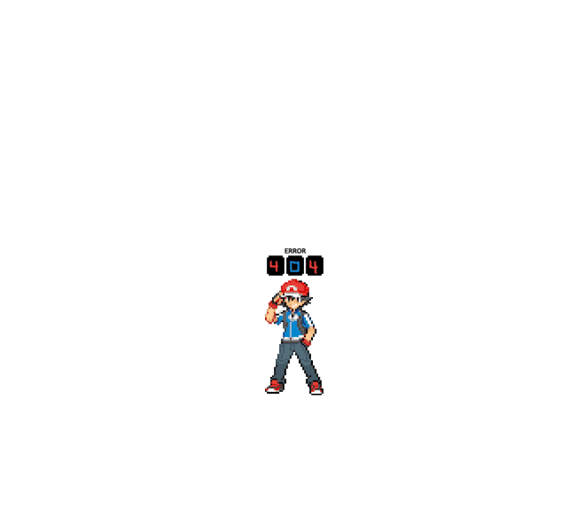

# AssPass

这组 555 名不幸的德根人在 OpenSea 入侵后失去了通行证，需要找到避难所

AssPass NFT - 常见问题（FAQ）

▶ 什么是 AssPass？

AssPass 是一个 NFT（不可替代令牌）集合。存储在区块链上的数字艺术品集合。

▶ 有多少 AssPass 代币？

总共有 125 个 AssPass NFT。目前，37 位所有者的钱包中至少有一个 AssPass NTF。

▶ 最近卖出了多少 AssPass？

过去 30 天内售出 0 个 AssPass NFT。

AssPass 在过去 7 天内售出 20 次。AssPass 的总销售额为 35.79 美元。一份 AssPass的平均价格为 1.8 美元。AssPass 拥有者 583 人，总供应量为 1,525 个。

 
