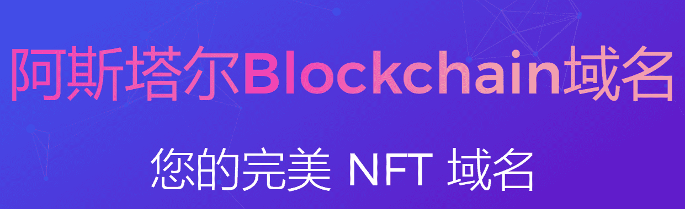
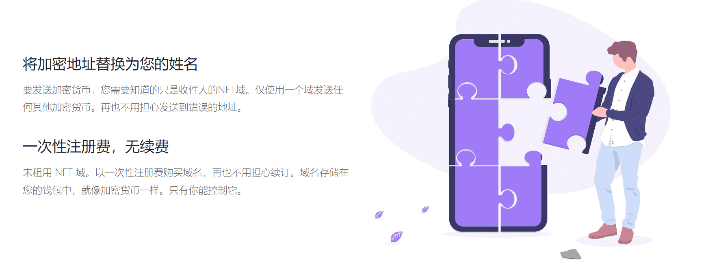
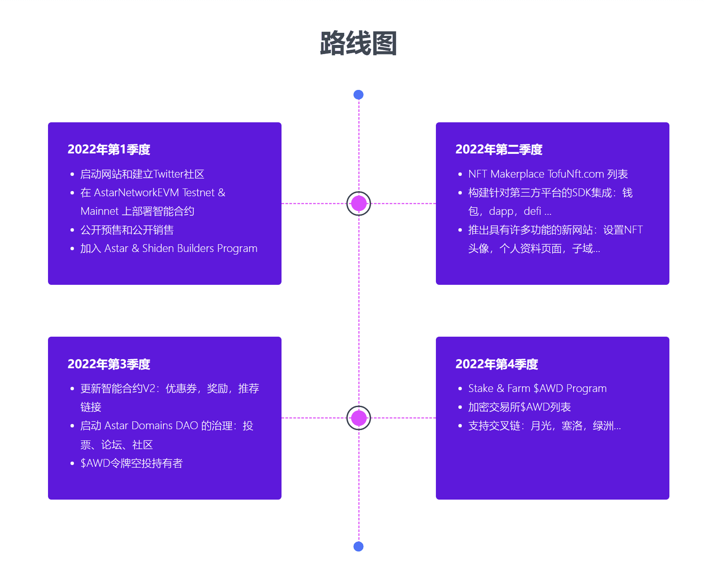

# Astar Web3 Domains (.astr)

用您的姓名替换加密地址 一次性注册费，无续订费 Ecosytem NFT 阿凡达

配置文件页面子域自定义数据SDK和API跨链许多顶级域NFT域

合并

要发送加密货币，您只需要知道收件人的NFT域名。仅使用一个域发送任何其他加密货币。不再担心发送到错误的地址。

NFT域名不被租赁。购买一次性注册费的域名，再也不用担心续订了。域名存储在您的钱包中，就像加密货币一样。只有你能控制它。

轻松将您的图片设置为头像。显示任何受支持的NFT头像 使用您的登陆页面显示您最喜欢的内容和多社交渠道

无限子域，只要您拥有主域名

存储各种自定义数据记录，稍后可以扩展。

SDK与钱包、dapps、defi等第三方平台集成...

支持在不同区块链平台之间传输FT域。

在一个智能合约上管理多个顶级域名，帮助以后扩展NFT域名。

将FT域集成到您的项目中，使您的DAPP和Web3.0网站更方便用户，并提供更好的用户体验。这将使您的分散式应用程序更加与众不同。

将NFT域集成到您的项目中，使您的DAPP和Web3.0网站更加用户友好，并提供更好的用户体验。这将使您的分散式应用程序更加差异化。

### FT域名 进入Web3世界的旅程 - 互联网的下一个时代

跨应用和网站的常用用户名、钱包的付款地址等。轻松安全地管理所有分布式服务
