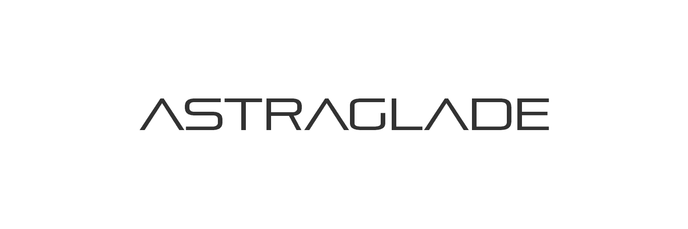

# Astraglade

Astraglade 是一个交互式的、生成的、3D 收藏实验。 Astraglades 通过独特的社会收集机制收集。 Astraglade 的每个版本都可以签名，该签名将永远保留在艺术品中。星宿特质

Astraglade NFT - 常见问题（FAQ）

▶ 什么是黄芪？

Astraglade 是一个 NFT（不可替代代币）集合。存储在区块链上的数字艺术品集合。

▶ 有多少 Astraglade 代币？

总共有 722 个 Astraglade NFT。目前，548 位车主的钱包中至少有一个 Astraglade NTF。

▶ 最近卖出了多少个黄芪甲？

过去 30 天内售出 0 个 Astraglade NFT。

