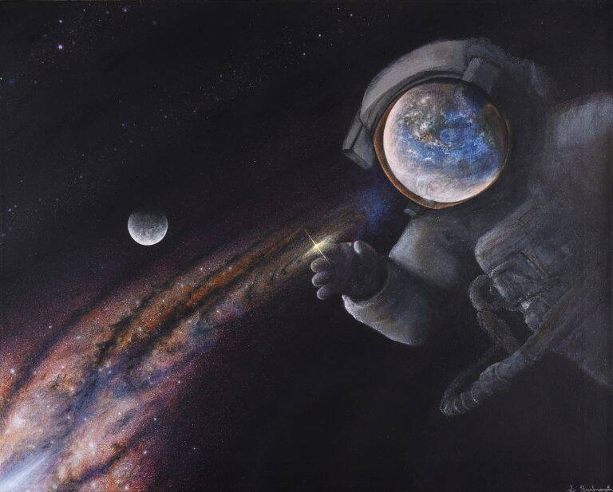

# Astral Reflections

来自另一个时间和地点的快照，实时捕获，它们的深度稍后会显示出来。

Astral Reflections NFT - 常见问题（FAQ）

▶ 什么是星体反射？

Astral Reflections 是一个 NFT（不可替代代币）集合。存储在区块链上的数字艺术品集合。

▶ 存在多少个 Astral Reflections 代币？

总共有 1 个 Astral Reflections NFT。目前 1 位所有者的钱包中至少有一个 Astral Reflections NTF。

▶ 最近卖出了多少 Astral Reflections？

过去 30 天内售出 0 个 Astral Reflections NFT。

过去 7 天没有售出星体反射。

Animae 是原始意识，是以太坊中神格的原子。

他们是元素和灵魂的诞生者，可以作为太阳神和其他极其强大的灵魂在星界航行。

[https://anima.host](https://anima.host/)

https://discord.gg/pAaFesVpbG

