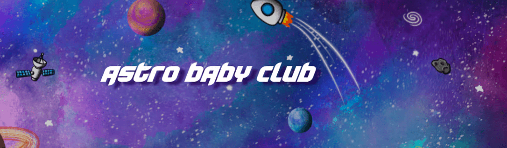

# Astro Baby Club NFT

Astro Baby Club 是在以太坊星系上生成的独特手绘 NFT 集合。 ABC 成立的核心使命是做好事，享受乐趣，突破 web3 的极限。 每个 NFT 都是 Astro Baby Club 的永久会员，从面对面和在线活动、商品、您独特的 NFT 的 IP 所有权等开始，您可以获得会员福利。 查看 www.AstroBabyClub.com 了解更多详情。

Astro Baby Club NFT - 常见问题（FAQ）

▶ 什么是Astro Baby Club ？

Astronuat Baby 是一个 NFT（不可替代代币）系列。存储在区块链上的数字艺术品集合。

▶ 有多少 Astro Baby Club 代币？

总共有 77 个 Astronuat Baby NFT。目前 8 位车主的钱包中至少有一个 Astronuat Baby NTF。

▶ 最近卖出了多少 Astro Baby Club？

过去 30 天内共售出 0 个 Astronuat Baby NFT。

