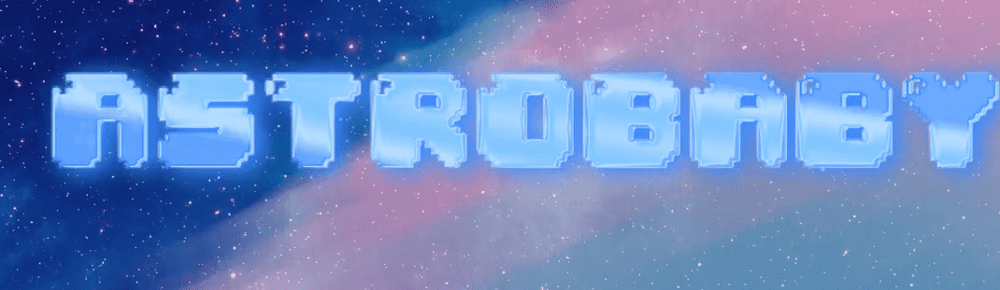

# Astrobaby NFT Official

☾ ﾟ｡⋆8,880 像素神奇生物将占星术与健康与 web3 技术联系起来⋆ﾟ｡☽‍

Astrobaby NFT Official NFT - 常见问题（FAQ）

▶ 什么是Astrobaby NFT Official？

Astrobaby NFT Official 是一个 NFT（不可替代代币）系列。存储在区块链上的数字艺术品集合。

▶ 有多少Astrobaby NFT Official 代币？

总共有 77 个Astrobaby NFT Official NFT。目前有 17 位车主的钱包里至少有一个 Astroboy x Japan NTF。

▶ 最近卖了多少Astrobaby NFT Official？

过去 30 天内共售出 1 个 Astrobaby NFT Official NFT。

▶ 什么是流行的Astrobaby NFT Officialn 替代品？

许多拥有 Astrobaby NFT Official NFT 的用户还拥有 [Rooster Fighter ETH](https://www.nft-stats.com/collection/rooster-fighter-eth)、 [Call Me Cutie Pie](https://www.nft-stats.com/collection/callmecutiepie)、 Ill [poop it nft](https://www.nft-stats.com/collection/pieceofshit-wtf)和 [Sunflower Land Farms](https://www.nft-stats.com/collection/sunflower-land)。

