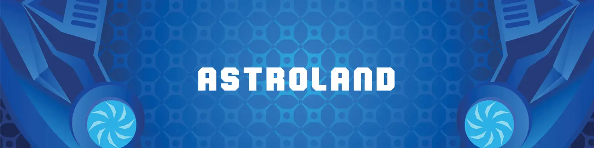

# Astroland 3D

500 个 Astrolands 的 3D 集合。 2 个月的工作。300 免费 MINT，剩余 0,001，售后最多 10Revel

所有者。 0.06。 底价。 0.00。 成交量。 全新系列的 3D 交易卡（Astrocards 3D）以独特的 3D 方式展示空间对象。 grid_on 项目。 show_chart 活动。 筛选。

这是我们的 3D 收藏 - 要访问我们的 Genesis 收藏，请单击此处 3D Pacas 是您进入即将到来的“PacaVerse”的门票。 无论您喜欢电子竞技、Play-to-Earn 游戏还是只是在 Metaverse 中进行社交，您的 Pacas 都能为您提供访问权限。通过在我们即将推出的游戏中表现出色，您可以获得可与现有 3D Paca 一起使用的特征。 而且 Pacas 也是可安装的，因此您的其他 3D 化身可以在沙盒中巡航时真正骑在您的 Paca 上！我们只是触及了表面，还有更多内容。 该团队正在与最优秀的 Sandbox 开发人员合作，为 Paca 用户在我们自己的 Sandbox 领域内外带来独特的创新体验。 敬请关注。

