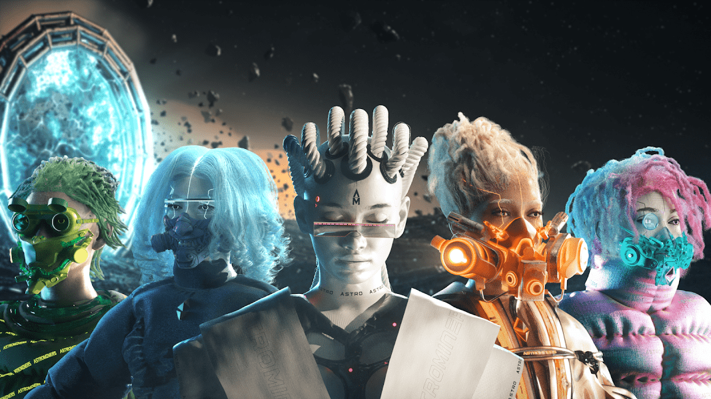

# Astrominers OfficiaI

在过去的 7 天里没有出售 Astrominers 官方产品。

8888 位独特的 Astrominers 前往 Metaverse 的遥远星球，在那里他们开采稀有矿物以获得丰厚的回报

Astrominers 官方 NFT - 常见问题（FAQ）
▶ 什么是 Astrominers 官员？
Astrominers Official 是一个 NFT（不可替代代币）集合。 存储在区块链上的数字艺术品集合。
▶ 有多少 Astrominers 官方代币？
总共有 217 个 Astrominers 官方 NFT。 目前，130 位所有者的钱包中至少有一个 Astrominers 官方 NTF。
▶ 最近卖出了多少 Astrominers Official？
过去 30 天内共售出 0 个 Astrominers 官方 NFT。
▶ 什么是流行的 Astrominers 官方替代品？
许多拥有 Astrominers 官方 NFT 的用户还拥有 Paladin Penguin Genesis Collection、Lost in Jukiverse、Awakened - Gear Tokens 和 Awakened Avatars。

