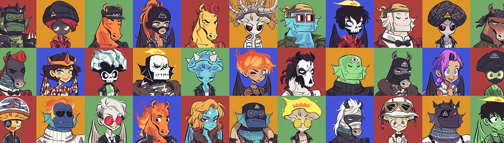

# ASWANG TRIBE OFFICIAL

Aswang Tribe 是受菲律宾神话启发的 3333 个注入实用程序的 NFT 的集合。这套极其多样化的个人资料图片艺术让您可以访问独一无二的数字收藏品生态系统，其中包括第 1 天质押、第 1 天育种和 web3 中最具创意的社区之一。每个 Aswang 旨在获得“祈祷等级”，您投入的时间越长。 最高的祈祷等级只能通过 333 年的质押才能获得——这是对区块链技术承诺的真正考验，将焦点放在其最被忽视的用例之一：文化保护。该系列包含 1111 匹 Tikbalang（坏马）、1111 匹 Siyokoy （乍得鱼家伙）和 1111 Duwende（qt 蘑菇），很快就会有 3333 Manananggal（恶魔电子女孩）加入。找到与你的灵魂对话的阿斯旺。加入部落。！祈祷👁️

