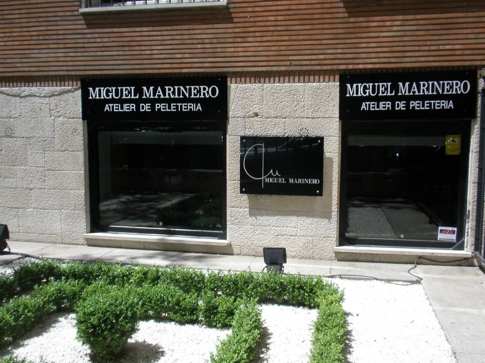

# Atelier de Miguel

过去 7 天没有售出 Atelier de Miguel。

Miguelgarest 创建的 NFT

▶ 什么是 Atelier de Miguel？
Atelier de Miguel 是一个 NFT（非同质代币）集合。 存储在区块链上的数字艺术品集合。
▶ Atelier de Miguel 代币有多少？
总共有 5 个 Atelier de Miguel NFT。 目前，173 位业主的钱包中至少有一个 Atelier de Miguel NTF。
▶ 最近卖出了多少 Atelier de Miguel？
过去 30 天内售出 0 个 Atelier de Miguel NFT。

经过米格尔加雷斯特
尽管一脸迷茫，这只小章鱼正在慢慢了解区块链。 没关系，他是在倒着看杂志，他已经准备好做笔记并准备好 3D 眼镜以防万一。 汽水罐只是陪伴他的旅程。

这是 Redlioneye Gazette 第 27 期艺术下降的特别版

