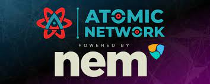
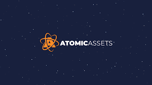

# Atomic Network

Atomic Network 是 Binance Smart Chain 区块链上的 DeFi 协议，有助于利用原生 Binance Smart Chain 资产创建完全抵押的稳定币。

🟢 总供应量 - 7.5 亿

🔥所有剩余的预售代币将被 100% 销毁！！！

🔒 流动性将被锁定

🚀 专业开发人员

🚀 强大的社区

💎 获得 30% BNB + 70% ATOM 奖励！ 💎

# 原子网络：世界上第一个免息稳定币协议基于币安智能链

币安智能链区块链上的 DeFi 协议，有助于利用原生币安智能链资产创建完全抵押的稳定币

### 什么是原子网络？

Atomic Network 是 Binance Smart Chain 区块链上的 DeFi 协议，它有助于利用原生 Binance Smart Chain 资产创建完全抵押的稳定币。

