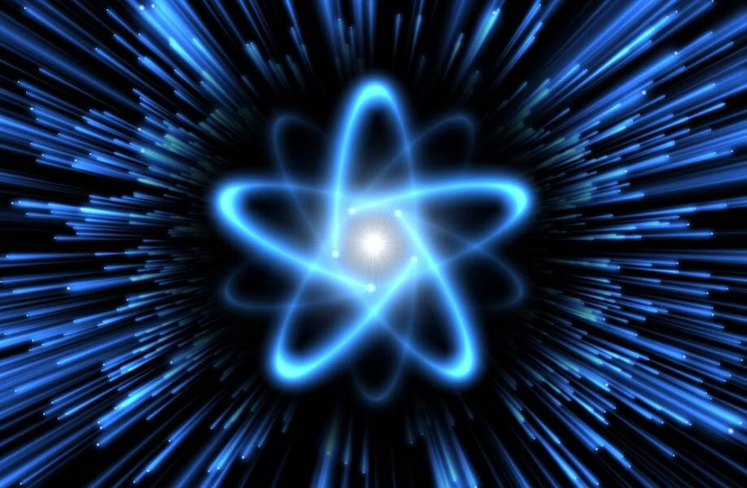

# Atomic Nuclear 721a test don't buy

梦想着环保核能的未来，我们提供这个 NFT 视频集，以促进核技术的科学应用和安全。收集 10,000 个核能提供会员访问权限，我们将为您提供各种活动 例如街头服饰合作、私人会员社区、NFT 空投和硬币燃烧。我们不会停止我们的愿景。为了用核科学创造更美好的世界，我们将支持 IAEA。

▶ 什么是原子核 721a 测试不买？
Atomic Nuclear 721a test don't buy 是一个 NFT（Non-fungible token）集合。 存储在区块链上的数字艺术品集合。
▶ 有多少原子核 721a 测试不买代币存在？
总共有 100 个原子核 721a 测试不要购买 NFT。 目前有 29 位车主至少有一次原子核 721a 测试，他们的钱包里没有购买 NTF。
▶ 最近卖出了多少不买的原子核 721a 测试？
在过去 30 天内，有 0 个原子核 721a 测试不购买 NFT。

